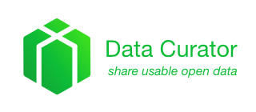
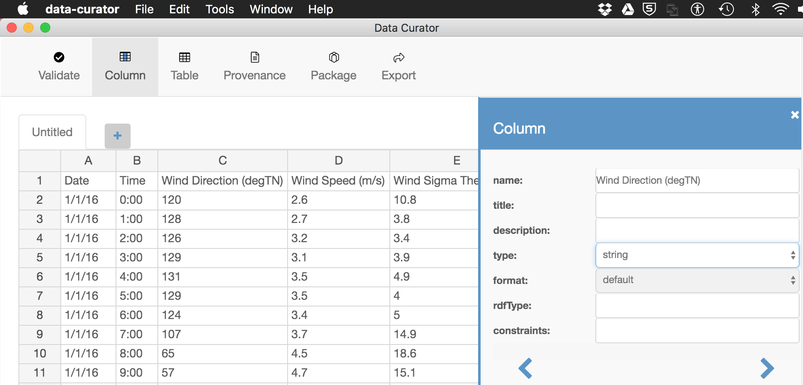

# Data Curator

Data Curator is a simple desktop CSV editor to help describe, validate and share usable open data.

## Why do we need Data Curator?

Open data creators are increasingly focusing on improving open data publishing so that data can be used to create insight and drive positive change.

Open data is more likely to be used if data consumers can:

- understand why and how the data was collected
- understand the structure of the data
- look up the meaning of codes used in the data
- understand the quality of the data
- access the data in an open machine-readable format
- know how the data is licensed and how it can be reused

## Planned features

Using Data Curator open data producers can:

- create new tabular data from scratch or from a template
- open data from a CSV or Microsoft Excel file
- open multiple related data tables from a [Data Package](http://frictionlessdata.io/data-packages/)
- automatically correct common problems found in CSV and Excel files
- edit data

Using data from any of these sources, you can:

- automatically create a [schema](http://specs.frictionlessdata.io/table-schema/) that describes the data fields
- refine the schema to include extra [data validation rules](http://specs.frictionlessdata.io/table-schema/#constraints)
- describe the [provenance](https://relishapp.com/odi-australia/data-curator/docs/tools/set-provenance-information) of your data
- save data as a valid CSV file in various [CSV dialects](http://specs.frictionlessdata.io/csv-dialect/)

The schema enables you to:

- validate the whole table at once
- validate a column at a time

Once the data is described and validated, you can share the data and its description by exporting a [Data Package](http://frictionlessdata.io/data-packages/) to:

- [publish](http://okfnlabs.org/blog/2016/07/25/publish-data-packages-to-datahub-ckan.html) on your [open data portal](https://ckan.org)
- use as a template for others to make similar data

Open data consumers can use published Data Packages to:

- view the data structure and provenance information to help determine if the data is fit for their purpose
- download the data together with its metadata in a single zip file
- use [a suite of tools](http://frictionlessdata.io/tools/) to work with the data

## Follow our progress

Interested in this project? Subscribe to [Data Curator News](https://github.com/ODIQueensland/data-curator/issues/15) to get occasional updates on our progress and hear about [each release](https://github.com/ODIQueensland/data-curator/releases).

## Contributions

We welcome all types of [contributions to Data Curator](https://github.com/ODIQueensland/data-curator/blob/master/.github/CONTRIBUTING.md)

We acknowledge the great work of others. We are:

- inspired by the [ODI](https://theodi.org) [Comma Chameleon](https://comma-chameleon.io/) experiment.
- using the [Open Knowledge International](https://okfn.org) Frictionless Data [specification](http://frictionlessdata.io) and [code libraries](http://frictionlessdata.io/tools/#javascript)
- adopting [W3C Data on the Web Best Practices](https://www.w3.org/TR/dwbp/#bp-summary)

## Download and Install Data Curator

Choose a platform from the [Releases page](https://github.com/ODIQueensland/data-curator/releases/latest).
